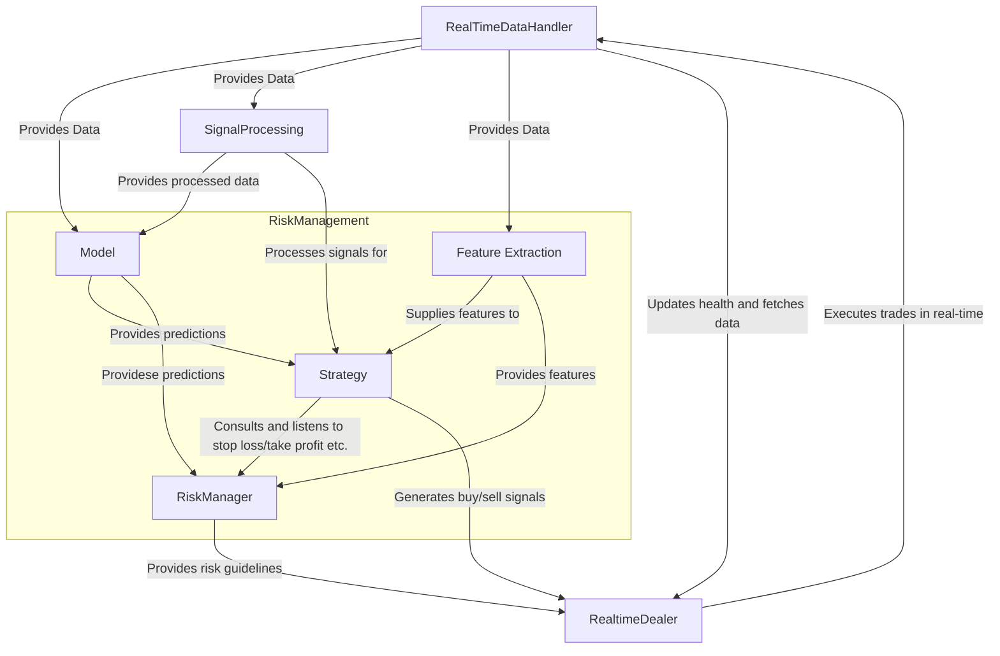

# Tradebot v3


Event-driven crypto trading bot

| Feature | Status |
|-----------|-----------|
| Real-time trading | Supported |
| Backtesting | Supported |
| Mock trading | Supported |
| Modular strategy plug-ins | Supported |
| Docker-based setup | Supported |
| CI testing with GitHub Actions | Supported |

## Overview
The most exciting version, with real time operations
Scalers are refreshed weekly to keep feature distributions up to date.
A custom feature selector is planned for the next release.

Tradebot v3 is a multi-symbol crypto trading bot that automates data collection, strategy backtesting, and live trading using the Binance API. This repository includes code, documentation, and resources necessary to run, test, and further develop the bot.

## Purpose
- **Project Goal:** Automate crypto trading strategies using a combination of classical technical indicators and machine learning models.
- **Key Features:** 
  - Backtesting engine with detailed performance reporting.
  - Real-time data handling for live or mock trading.
  - Modular design for strategy evaluation and portfolio management.

## Getting Started

### Prerequisites
- Python 3.8+
- Required packages can be installed via:
  ```bash
  pip install -r requirements.txt
  ```
- Or run everything in Docker (no local Python needed):
  ```bash
  docker compose build builder   # build image & run smoke‑tests
  docker compose up backtester   # launch back‑test
  ```

### Running the Code

| Mode | Local (Python) | Docker |
|------|----------------|--------|
| **Back-test** | `python scripts/backtest_v1.py` | `docker compose up backtester` |
| **Mock trade** | `python scripts/mock_trade.py` | `docker compose up mocktrader` |
| **Fetch data** | `python scripts/fetch_data.py` | `docker compose up fetcher` |
| **Smoke tests** | `pytest -q tests` | `docker compose run --rm backtester pytest -q` |

_Back-test results are written to `/backtest/performance`, mock-trade logs to `/mock/logs`, fetched raw data to `/data`._

### Progress-bar behaviour in Docker

When you launch services with `docker compose up`, the `tqdm` progress bar  
doesn’t have access to a real TTY, so each refresh prints on a new line.  
You have two options:

| Goal | Command |
|------|---------|
| **Clean, single‑line bar** | `docker compose run --rm --tty backtester` |
| **Quiet logs (no bar)** | `TQDM_DISABLE=1 docker compose up backtester` |

In standard local runs (`python scripts/backtest_v1.py`), progress bars behave normally. No source‑code changes are required.

- **Customize the configurations**
  For Backtest, go to: /backtest/config
  For Live/Mock Trading, go to /config
  There are some extra configurations for the mock accounts, go to /mock/logs

## Pre-Analysis
- Folder 'notebooks' contains data manipulations and some tests for strategies before implementation

## Example Reports

- [Strategy Report – March 2025 (PDF)](./reports/StrategyReportMar_2025.pdf)
- [Structure Report – March 2025 (PDF)](./reports/StructureReportMar_2025.pdf)

## Continuous Integration

Every push and pull request triggers a GitHub Actions workflow that:

1. Builds the Docker image via the **builder** service  
2. Runs the smoke‑test suite inside the container

A green badge (above) indicates all tests are passing.

## Future Developments
- For planned enhancements and feature requests, refer to the `doc/Future developments.md` file.


## Contact
For questions or further information, please contact:  
Zhaoyu Bai – zbaiy.imsoion@yahoo.com


for DOGE or others who only works with integer amount, need to round down, we did it in risk manager, but also need to integrate it when dealing with fees.

## My Trading Bot Architecture



### Adding your own strategy (≈ 10 lines, modify in config/strategy)

A *strategy* in **Tradebot v3** is a **pipeline of three plug‑ins**:

| Stage | Loader helper | Purpose | Example class |
|-------|---------------|---------|---------------|
| **Model** | `core.model.get()` | Generate raw buy/sell scores | `MACDwADX, RSIwADX` |
| **Decision‑maker** | `core.decision.get()` | Transform scores → discrete signals | `ThresholdMode1` |
| **Risk‑manager** | `core.risk.get()` | Size, stop‑loss, take‑profit | `ATRStopLoss`, `RiskReward` |

Configure each symbol in `config/strategy.json`:

```jsonc
{
  "BTCUSDT": {
    "model": {
      "method":  "MACDwADX",
      "params":  { "rsi_var_window": 23, "adx_threshold": 20 }
    },
    "decision_maker": {
      "method": "ThresholdMode1",
      "params": { "threshold": 0.002 }
    },
    "risk_manager": {
      "stop_method":      "atr",
      "take_method":      "risk_reward",
      "position_method":  "none",
      "stop_params":      { "atr_window": 14, "para1": 0.05 },
      "take_params":      { "risk_reward_ratio": 4 },
      "position_params":  { "fixed_fraction": 1.0 }
    }
  }
}
```

Drop‑in rules for **any** plug‑in stage:

```python
# src/model/model.py
class MyCoolModel:

    def predict(self, df): ...

# src/decision/threshold_mode2.py
class ThresholdMode2:

    def decide(self, scores): ...

```

After adding a file and committing, simply rebuild the Docker image:

```bash
docker compose build builder
```

The loader auto‑registers your new classes—no core code changes needed.
*Currently available baseline models: `MACDModel`, `MACDwADX`, `RSIwADX`, `ForTesting`.  More advanced models will be added in the next release.*
